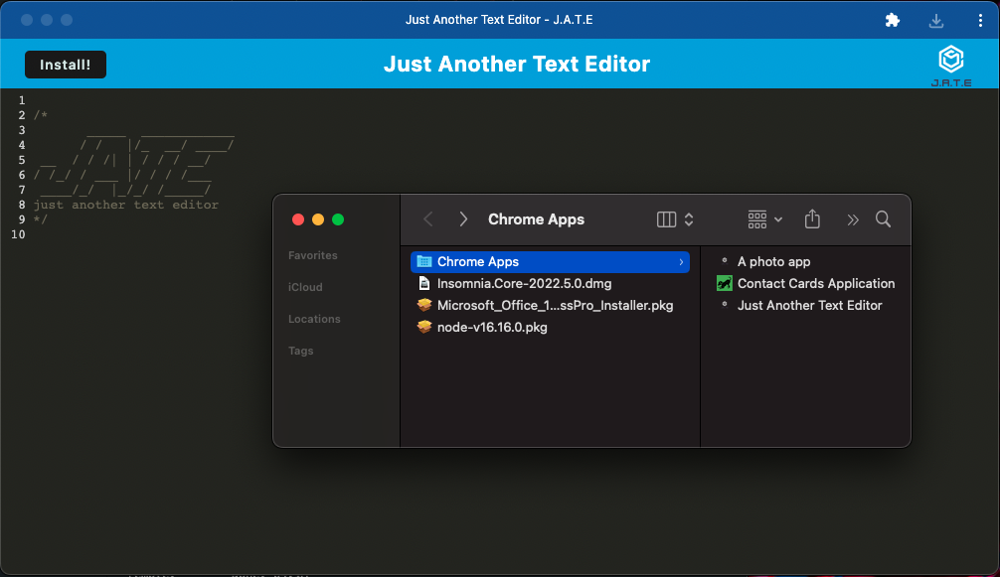

# urban_text_editor

## Description
Text editor that saves my notes as I move into and out of focus. Installable to work offline and sync!

The app runs in the browser and is a single-page application that meets the PWA criteria. Additionally, features a number of data persistence techniques that serve as redundancy in case one of the options is not supported by the browser. The application also functions offline.

This project uses package `idb`, a lightweight wrapper around the IndexedDB API. It features methods that are useful for storing and retrieving data, and is used by companies like Google and Mozilla.
Then deployed to Heroku.

## Table of Contents
  - [Getting Started](#gettingstarted)
  - [Usage](#usage)
  - [Installation](#installation)
  - [Screenshots and Video](#screenshots_video)
  - [Contributing](#contributing)
  - [Questions](#questions)
  - [License](#license)
      
## Getting Started

Uses webpack [webpack](https://webpack.js.org/), a module bundler for JavaScript that simplifies front-end web development to bundle JavaScript and the webpack's [HTMLWebpackPlugin](https://webpack.js.org/plugins/html-webpack-plugin/) to generate an HTML page.

Also, IndexedDB and [idb](https://www.npmjs.com/package/idb), a small wrapper that makes it easier to implement IndexedDB CRUD methods to add the ability to store structured data to the browser. 

Offline function [Workbox](https://developers.google.com/web/tools/workbox), which is a set of libraries that can generate a production-ready service worker for your Progressive Web App. 

Install on local device or view on heroku: https://damp-escarpment-93332.herokuapp.com/

## Usage
Simple note taking PWA app that bundles and minimizes packages for quick and simple loading and usage.

## Installation
Locally, "npm start" will initiate the program with a service worker and precache for offline persistance. Install with the "INSTALL" button. Click live link to open app directly and type away!

## Screenshots 

## Questions

Have questions?
You can find me on GitHub:
https://github.com/BeKind-Rewind

Or email me at:
challenge641@gmail.com

## License

Licensed under the [MIT](https://choosealicense.com/licenses/mit/) license.